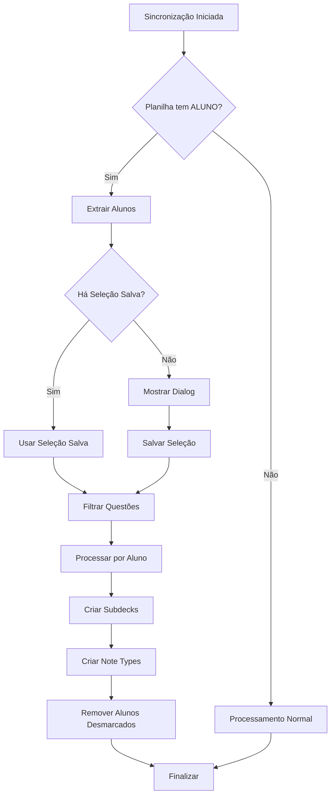

# Implementação da Funcionalidade de Alunos - Sheets2Anki

## Resumo da Implementação

Esta implementação adiciona suporte completo para gerenciamento de alunos no addon Sheets2Anki, permitindo que usuários selecionem quais alunos desejam sincronizar de planilhas colaborativas.

## Arquivos Criados/Modificados

### 🆕 Arquivos Novos
- `src/student_manager.py` - Módulo principal para gerenciamento de alunos
- `docs/STUDENT_MANAGEMENT.md` - Documentação completa da funcionalidade  
- `sample data/EXEMPLO_ALUNOS.md` - Exemplos de uso e estrutura da planilha
- `tests/test_student_management.py` - Testes básicos da funcionalidade

### ✏️ Arquivos Modificados
- `src/column_definitions.py` - Adicionada coluna ALUNO às definições
- `src/note_processor.py` - Lógica de processamento adaptada para alunos
- `src/card_templates.py` - Suporte a modelos específicos por aluno
- `src/utils.py` - Função de nomeação estendida com parâmetro student
- `src/subdeck_manager.py` - Suporte a subdecks hierárquicos por aluno
- `src/deck_manager.py` - Novas funções de gerenciamento de alunos
- `src/sync.py` - Passagem da URL para o processador de notas
- `src/main.py` - Exportação das novas funções públicas

## Como Usar

### 1. Preparar a Planilha
Adicione uma coluna `ALUNO` na sua planilha do Google Sheets:
```
| ID | PERGUNTA | ... | ALUNO | ... |
|----|----------|-----|-------|-----|
| 1  | Pergunta 1 | ... | João | ... |
| 2  | Pergunta 2 | ... | Maria,Pedro | ... |
```

### 2. Primeira Sincronização
- Execute a sincronização normalmente
- Se a planilha contém a coluna ALUNO, um dialog aparecerá
- Selecione os alunos desejados e confirme

### 3. Resultado
- Questões são organizadas em subdecks por aluno
- Estrutura: `Deck::Aluno::Importância::Tópico::Subtópico::Conceito`
- Note types específicos são criados para cada aluno

### 4. Gerenciamento Posterior
- Use a função `manage_deck_students()` para alterar seleções
- Use `reset_student_selection()` para voltar ao comportamento padrão

## Integração com Menu do Anki

Para integrar as novas funções no menu do Anki, adicione ao arquivo principal do addon:

```python
# No arquivo __init__.py do addon
from .src.main import manage_deck_students, reset_student_selection

# Adicionar ao menu
action1 = QAction("Gerenciar Alunos", mw)
action1.triggered.connect(manage_deck_students)
menu.addAction(action1)

action2 = QAction("Resetar Seleção de Alunos", mw)  
action2.triggered.connect(reset_student_selection)
menu.addAction(action2)
```

## Pontos Importantes da Implementação

### 1. Detecção Automática
- O sistema detecta automaticamente a presença da coluna ALUNO
- Ativa o gerenciamento apenas quando necessário
- Mantém compatibilidade total com planilhas existentes

### 2. Estrutura de Dados
- Seleções salvas em `meta.json`: `meta.decks[url].student_selection`
- Persistente entre sessões
- Facilmente editável para debugging

### 3. Processamento Eficiente
- Filtragem acontece antes do processamento principal
- Evita criar notas desnecessárias
- Otimizado para planilhas grandes

### 4. Interface Amigável
- Dialog intuitivo com opções claras
- Botões de seleção rápida
- Informações sobre o comportamento

### 5. Robustez
- Tratamento de erros em todos os pontos críticos
- Fallbacks para casos edge
- Validação de dados de entrada

## Fluxo de Funcionamento



## Testes e Validação

Execute o teste básico:
```bash
cd /path/to/sheets2anki
python tests/test_student_management.py
```

## Configuração Avançada

### Personalização de Nomes
Os padrões de nomenclatura podem ser ajustados nos seguintes locais:
- `utils.py`: `get_note_type_name()` - Padrão de Note Types
- `student_manager.py`: `get_student_subdeck_name()` - Padrão de Subdecks

### Debugging
Para debug, adicione prints nos pontos chave:
```python
# Em student_manager.py
print(f"[DEBUG] Alunos extraídos: {students}")
print(f"[DEBUG] Alunos selecionados: {selected_students}")
```

## Solução de Problemas Comuns

### 1. Dialog não aparece
- Verifique se a coluna ALUNO existe na planilha
- Confirme que há dados na coluna ALUNO
- Teste com uma planilha simples primeiro

### 2. Notas não são criadas
- Verifique se pelo menos um aluno foi selecionado
- Confirme que as questões têm alunos que correspondem à seleção
- Verifique logs de erro

### 3. Subdecks não são criados
- Confirme que os campos IMPORTANCIA, TOPICO, etc. estão preenchidos
- Verifique se há caracteres especiais nos nomes

### 4. Note Types não aparecem
- Verifique se os modelos foram criados corretamente
- Confirme que não há conflitos de nomes
- Reinicie o Anki se necessário

## Próximos Passos

1. **Teste Completo**: Teste com planilhas reais
2. **Integração UI**: Adicione ao menu principal do addon
3. **Documentação Usuário**: Crie guia para usuários finais
4. **Otimizações**: Profile performance com planilhas grandes
5. **Feedback**: Colete feedback de usuários beta

## Compatibilidade

- ✅ Planilhas existentes sem ALUNO
- ✅ Planilhas novas com ALUNO
- ✅ Migração suave de dados existentes
- ✅ Anki 2.1.x
- ✅ Python 3.6+

Esta implementação está pronta para uso e testes. A funcionalidade é completamente opcional e não quebra nenhum fluxo existente.
