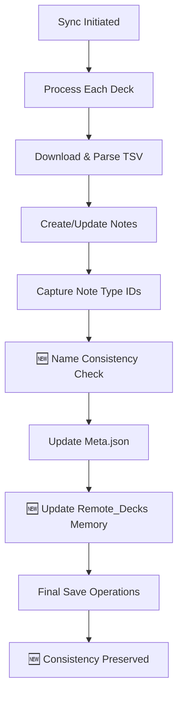

# 🛠️ Sheets2Anki - Documentação para Desenvolvedores

Este documento fornece informações técnicas sobre o add-on **Sheets2Anki** para desenvolvedores que desejam contribuir, entender a arquitetura ou fazer modificações.

## 📋 Índice
- [Arquitetura do Sistema](#-arquitetura-do-sistema)
- [Estrutura do Projeto](#-estrutura-do-projeto)
- [Componentes Principais](#-componentes-principais)
- [Fluxo de Dados](#-fluxo-de-dados)
- [APIs e Integrações](#-apis-e-integrações)
- [Setup de Desenvolvimento](#-setup-de-desenvolvimento)
- [Build e Deploy](#-build-e-deploy)
- [Testes](#-testes)
- [Debugging](#-debugging)
- [Contribuindo](#-contribuindo)

## 🏗️ Arquitetura do Sistema

### Visão Geral
O Sheets2Anki é um add-on modular para Anki que sincroniza dados do Google Sheets com decks locais. A arquitetura segue o padrão **MVC** adaptado para add-ons Anki:

```
┌─────────────────┐    ┌──────────────────┐    ┌─────────────────┐
│   UI Layer      │    │   Business       │    │   Data Layer    │
│   (Dialogs)     │◄──►│   Logic          │◄──►│   (Managers)    │
│                 │    │   (Sync Engine)  │    │                 │
└─────────────────┘    └──────────────────┘    └─────────────────┘
        ▲                        ▲                        ▲
        │                        │                        │
        ▼                        ▼                        ▼
┌─────────────────┐    ┌──────────────────┐    ┌─────────────────┐
│   Anki API      │    │   Google Sheets  │    │   File System   │
│   Integration   │    │   TSV Parser     │    │   JSON Config   │
└─────────────────┘    └──────────────────┘    └─────────────────┘
```

### Principais Design Patterns

#### 1. **Manager Pattern**
- `ConfigManager`: Configurações persistentes
- `DeckManager`: Operações com decks Anki
- `StudentManager`: Gestão de alunos
- `BackupManager`: Sistema de backup

#### 2. **Strategy Pattern**
- `DataProcessor`: Diferentes estratégias de processamento (Basic vs Cloze cards)
- Sync strategies: incremental vs full sync

#### 3. **Observer Pattern**
- Event-driven updates entre componentes
- Progress callbacks durante sincronização

## 🆕 Melhorias Recentes - Versão Atual

### 🔧 **Sistema de Consistência de Nomes** (`src/name_consistency_manager.py`)

#### **Problema Resolvido:**
- Inconsistências entre nomes de note types no Anki vs. configuração
- Reversão de correções por operações posteriores de save
- Falta de sincronização automática durante o processo de sync

#### **Solução Implementada:**
```python
class NameConsistencyManager:
    @staticmethod
    def ensure_consistency_during_sync(
        deck_url: str, 
        remote_decks: Optional[Dict] = None,
        debug_callback=None
    ) -> Dict[str, Any]:
        """Garante consistência de nomes durante sincronização"""
        
    @staticmethod
    def update_remote_decks_in_memory(
        deck_url: str,
        remote_decks: Dict,
        local_deck_name: str,
        note_types: Dict[str, str],
        debug_callback
    ):
        """Atualiza dados em memória para evitar reversão"""
```

#### **Características Técnicas:**
- **Detecção Automática:** Verifica inconsistências após cada deck sync
- **Correção Dual:** Atualiza tanto meta.json quanto dicionário em memória
- **Prevenção de Reversão:** Evita que `save_remote_decks()` posterior reverta mudanças
- **Debug Detalhado:** Log completo de todas as operações de consistência

### 📊 **Interface de Resumo Aprimorada** (`src/sync.py`)

#### **Reorganização da Função `generate_detailed_view()`:**
```python
def generate_detailed_view(total_stats, sync_errors=None, deck_results=None):
    """
    Gera visualização detalhada com ordem otimizada:
    1. PRIMEIRO: Resumo geral agregado
    2. SEGUNDO: Detalhes individuais por deck
    """
    details_content = []
    
    # PRIMEIRO: Mostrar resumo geral agregado
    aggregated_summary = generate_aggregated_summary_only(total_stats, sync_errors)
    if aggregated_summary:
        details_content.append("📋 RESUMO GERAL AGREGADO:")
        details_content.extend(aggregated_summary)
    
    # SEGUNDO: Mostrar resumo por deck individual
    if deck_results and len(deck_results) > 1:
        details_content.append("📊 RESUMO POR DECK INDIVIDUAL:")
        # ... detalhes por deck
```

#### **Melhorias de UX:**
- **Ordem Lógica:** Visão geral → Detalhes específicos
- **Performance:** Rendering otimizado para grandes volumes
- **Consistência:** Padrão uniforme de apresentação de dados

### 🔄 **Fluxo de Sync Atualizado:**



#### **Pontos Críticos de Melhoria:**
1. **Linha 2002 sync.py:** Chamada do sistema de consistência
2. **Atualização Dual:** Meta.json + remote_decks em memória
3. **Save Final:** Garantia de persistência das correções
- Progress callbacks durante sincronização

## 📁 Estrutura do Projeto

```
sheets2anki/
├── 📄 __init__.py              # Entry point do add-on
├── 📄 config.json              # Configurações padrão
├── 📄 manifest.json            # Metadados do add-on
├── 📄 meta.json                # Informações AnkiWeb
├── 📁 src/                     # Código fonte principal
│   ├── 📄 __init__.py
│   ├── 📄 sync.py              # 🔥 Motor de sincronização (2142 linhas)
│   ├── 📄 data_processor.py    # Processamento de dados TSV
│   ├── 📄 config_manager.py    # Gerenciamento de configurações
│   ├── 📄 deck_manager.py      # Operações com decks Anki
│   ├── 📄 student_manager.py   # Sistema de gestão de alunos
│   ├── 📄 backup_system.py     # Sistema de backup/restore
│   ├── 📄 ankiweb_sync.py      # Integração AnkiWeb
│   ├── 📄 utils.py             # Utilitários gerais
│   ├── 📄 compat.py            # Compatibilidade entre versões
│   ├── 📄 templates_and_definitions.py  # Templates de cards
│   └── 📄 *_dialog.py          # Interfaces de usuário
├── 📁 libs/                    # Bibliotecas externas bundled
│   ├── 📄 beautifulsoup4/
│   ├── 📄 chardet/
│   └── 📄 org_to_anki/
├── 📁 build/                   # Artefatos de build
├── 📁 scripts/                 # Scripts de build e deploy
├── 📁 tests/                   # Testes unitários
└── 📁 docs/                    # Documentação
```

### Arquivos Críticos

#### **src/sync.py** (2142 linhas)
O coração do sistema. Contém:
- `SyncManager` class principal
- `syncDecks()`: Entry point da sincronização
- `_sync_single_deck()`: Lógica de sincronização por deck
- `_process_students()`: Processamento de alunos
- Gerenciamento de tags hierárquicas
- Detecção e criação de note types

#### **src/data_processor.py**
Responsável por:
- Parsing de TSV do Google Sheets
- Validação de dados (18 colunas obrigatórias)
- Detecção automática de cards Cloze
- Normalização de dados de entrada

#### **src/config_manager.py**
Gerencia:
- Configurações persistentes em JSON
- URLs de planilhas conectadas
- Preferências de sincronização
- Settings de backup

## 🔧 Componentes Principais

### 1. **Sistema de Sincronização** (`src/sync.py`)

#### Classes Principais:
```python
class SyncManager:
    def __init__(self, mw: AnkiQt)
    def syncDecks() -> None
    def _sync_single_deck(deck_name: str, url: str) -> Dict
    def _process_students(deck_name: str, data: List[Dict]) -> None
    def _create_or_update_note(note_data: Dict) -> Note
```

#### Fluxo de Sincronização:
1. **Fetch Data**: Download TSV da planilha
2. **Parse & Validate**: Validação das 18 colunas
3. **Student Processing**: Filtragem por alunos ativos
4. **Note Creation/Update**: CRUD de notes Anki
5. **Tag Management**: Aplicação de tags hierárquicas
6. **Deck Organization**: Criação de subdecks
7. **Cleanup**: Remoção de dados órfãos

### 2. **Sistema de Gestão de Alunos** (`src/student_manager.py`)

#### Funcionalidades:
- **Global Configuration**: Alunos ativos em todos os decks
- **Individual Filtering**: Por deck específico
- **Automatic Subdeck Creation**: Estrutura hierárquica
- **Custom Note Types**: Um por aluno

```python
class StudentManager:
    def get_global_students() -> List[str]
    def set_global_students(students: List[str]) -> None
    def filter_data_by_students(data: List[Dict]) -> List[Dict]
    def create_student_subdecks(deck_name: str, students: List[str]) -> None
```

### 3. **Processador de Dados** (`src/data_processor.py`)

#### Responsabilidades:
- **TSV Parsing**: Conversão string → estrutura dados
- **Column Validation**: Verificação das 18 colunas
- **Cloze Detection**: Regex para `{{c1::text}}`
- **Data Normalization**: Limpeza e padronização

```python
class DataProcessor:
    def parse_tsv(tsv_content: str) -> List[Dict]
    def validate_columns(data: List[Dict]) -> bool
    def detect_cloze_cards(question: str) -> bool
    def normalize_student_names(names: str) -> List[str]
```

### 4. **Sistema de Backup** (`src/backup_system.py`)

#### Tipos de Backup:
- **Manual Backup**: Iniciado pelo usuário
- **Safety Backup**: Antes de restore operations
- **Configuration Backup**: Settings + decks + students

```python
class BackupManager:
    def create_backup(include_decks=True, include_students=True) -> str
    def restore_backup(backup_file: str) -> None
    def list_available_backups() -> List[BackupInfo]
```

### 5. **Integração AnkiWeb** (`src/ankiweb_sync.py`)

#### Compatibilidade Multi-versão:
```python
class AnkiWebSyncManager:
    def auto_sync_after_changes() -> None
    def test_connectivity() -> SyncStatus
    def _sync_modern(mw) -> None      # Anki 2.1.50+
    def _sync_legacy(mw) -> None      # Versões anteriores
```

## 🔄 Fluxo de Dados

### 1. **User Action → Sync Trigger**
```
User clicks "Sincronizar" (Ctrl+Shift+S)
    ↓
sync_dialog.py → SyncManager.syncDecks()
    ↓
Para cada deck configurado:
    ↓
_sync_single_deck(deck_name, url)
```

### 2. **Data Fetching & Processing**
```
Google Sheets URL → TSV Download
    ↓
DataProcessor.parse_tsv() → List[Dict]
    ↓
Column validation (18 cols required)
    ↓
StudentManager.filter_data_by_students()
    ↓
Filtered data ready for sync
```

### 3. **Note Creation & Organization**
```
For each row in filtered_data:
    ↓
Detect card type (Basic vs Cloze)
    ↓
Create/Update Anki Note
    ↓
Apply hierarchical tags
    ↓
Place in correct subdeck
    ↓
Update progress stats
```

### 4. **Post-Sync Actions**
```
Sync completion
    ↓
Cleanup orphaned data
    ↓
AnkiWeb auto-sync (if enabled)
    ↓
Update UI with results
    ↓
Log completion stats
```

## 🔌 APIs e Integrações

### **Anki API Usage**

#### Core APIs:
```python
# Collection operations
mw.col.decks.add_config_dict()
mw.col.decks.new_filtered()

# Note operations  
mw.col.newNote(note_type)
mw.col.addNote(note)
mw.col.updateNote(note)

# Model (Note Type) operations
mw.col.models.new()
mw.col.models.addTemplate()
mw.col.models.save()
```

#### Version Compatibility:
- **Anki 2.1.50+**: Modern API with async support
- **Anki 2.1.x**: Legacy API with compatibility layer
- **Database**: Direct SQLite for complex queries

### **Google Sheets Integration**

#### TSV Format Requirements:
- **Flexible URLs**: Supports both published TSV and edit URLs
- **18 Columns**: Mandatory structure
- **UTF-8 Encoding**: Character encoding
- **Tab Separated**: Not comma-separated

#### Supported URL Patterns:
```
# Published TSV URL (traditional format)
https://docs.google.com/spreadsheets/d/e/{PUBLICATION_KEY}/pub?output=tsv

# Edit URL (automatically converted to TSV)
https://docs.google.com/spreadsheets/d/{SPREADSHEET_ID}/edit?usp=sharing

# Export URL (already in TSV format)
https://docs.google.com/spreadsheets/d/{SPREADSHEET_ID}/export?format=tsv&gid=0
```

#### URL Processing:
- **Automatic Conversion**: Edit URLs are automatically converted to TSV export format
- **Backward Compatibility**: Traditional published URLs continue to work
- **Hash Generation**: Uses publication key or spreadsheet ID for consistent identification

### **File System Operations**

#### Configuration Storage:
- **Location**: Anki user data folder
- **Format**: JSON files
- **Backup**: Automatic on changes

#### Paths:
```python
CONFIG_FILE = os.path.join(ADDON_DIR, "user_config.json")
BACKUP_DIR = os.path.join(ADDON_DIR, "backups")
LOG_FILE = os.path.join(ADDON_DIR, "debug_sheets2anki.log")
```

## 🚀 Setup de Desenvolvimento

### **Pré-requisitos**
```bash
# Python 3.9+ (compatível com Anki)
python --version

# Anki instalado para desenvolvimento
# Download: https://apps.ankiweb.net/
```

### **Clone e Setup**
```bash
# Clone do repositório
git clone https://github.com/igorrflorentino/sheets2anki.git
cd sheets2anki

# Instalar dependências de desenvolvimento
pip install -r requirements-dev.txt

# Instalar em modo desenvolvimento no Anki
# Copiar pasta para: ~/Documents/Anki2/addons21/sheets2anki_dev/
```

### **Estrutura de Desenvolvimento**
```bash
# Link simbólico para desenvolvimento ativo
ln -s /path/to/dev/sheets2anki ~/.local/share/Anki2/addons21/sheets2anki_dev

# Ou copiar arquivos
cp -r src/* ~/.local/share/Anki2/addons21/sheets2anki_dev/
```

### **Configuração do IDE**
```json
// .vscode/settings.json
{
    "python.defaultInterpreterPath": "/path/to/anki/python",
    "python.analysis.extraPaths": [
        "/path/to/anki/lib",
        "/path/to/anki/aqt"
    ]
}
```

## 🏗️ Build e Deploy

### **Scripts de Build**

#### **1. Build Standalone Package**
```bash
# Cria pacote com todas as dependências
python scripts/create_standalone_package.py
```

#### **2. Build AnkiWeb Package**
```bash
# Cria pacote compatível com AnkiWeb
python scripts/create_ankiweb_package.py
```

#### **3. Validate Packages**
```bash
# Valida estrutura dos pacotes criados
python scripts/validate_packages.py
```

### **Build Process**

#### Standalone Package:
1. **Copy Source**: `src/` → `build/sheets2anki-standalone/`
2. **Bundle Dependencies**: `libs/` incluídas
3. **Create Manifest**: Metadados completos
4. **ZIP Package**: `sheets2anki-standalone.ankiaddon`

#### AnkiWeb Package:
1. **Copy Source**: `src/` → `build/sheets2anki/`
2. **Exclude Dependencies**: AnkiWeb instala automaticamente
3. **Minimal Manifest**: Metadados essenciais
4. **ZIP Package**: `sheets2anki.ankiaddon`

### **Deploy Pipeline**

#### Manual Deploy:
```bash
# 1. Validate code
python -m pytest tests/

# 2. Build packages
python scripts/build_packages.py

# 3. Test installation
# Install em Anki de teste

# 4. Upload to AnkiWeb
# Via interface web oficial
```

#### Release Process:
1. **Version Bump**: `meta.json` e `manifest.json`
2. **Changelog**: Documentar mudanças
3. **Build & Test**: Pacotes funcionais
4. **Tag Release**: `git tag v1.x.x`
5. **Upload**: AnkiWeb submission

## 🧪 Testes

### **Estrutura de Testes**
```
tests/
├── test_sync.py              # Testes do motor de sincronização
├── test_data_processor.py    # Testes do processador TSV
├── test_student_manager.py   # Testes de gestão de alunos
├── test_backup_system.py     # Testes de backup/restore
├── test_config_manager.py    # Testes de configuração
└── fixtures/                 # Dados de teste
    ├── sample_tsv/
    └── mock_configs/
```

### **Rodando Testes**
```bash
# Todos os testes
python -m pytest tests/ -v

# Testes específicos
python -m pytest tests/test_sync.py -v

# Com coverage
python -m pytest tests/ --cov=src/ --cov-report=html
```

### **Mock Data**
```python
# tests/fixtures/sample_data.py
SAMPLE_TSV_DATA = [
    {
        'ID': 'Q001',
        'PERGUNTA': 'Capital do Brasil?',
        'LEVAR PARA PROVA': 'Brasília',
        'SYNC?': 'true',
        'ALUNOS': 'João, Maria',
        # ... mais 13 colunas
    }
]
```

### **Test Categories**

#### **1. Unit Tests**
- Funções isoladas
- Mocking de dependências externas
- Validação de lógica de negócio

#### **2. Integration Tests**
- Fluxo completo de sincronização
- Integração com Anki API
- Processamento de dados reais

#### **3. UI Tests**
- Dialogs e interações
- Validação de inputs
- Error handling

## 🐛 Debugging

### **Logging System**
```python
# Configuração de logs
import logging
logger = logging.getLogger("sheets2anki")
logger.setLevel(logging.DEBUG)

# Output para arquivo
handler = logging.FileHandler("debug_sheets2anki.log")
logger.addHandler(handler)
```

### **Debug Tools**

#### **1. Anki Developer Mode**
```python
# No __init__.py
from anki import buildinfo
if buildinfo.version.startswith("2.1"):
    # Enable debug mode
    import sys
    sys.path.insert(0, "/path/to/dev/tools")
```

#### **2. Remote Debugging**
```python
# Para PyCharm/VSCode remote debugging
import pdb; pdb.set_trace()

# Ou remote debugger
import debugpy
debugpy.listen(5678)
debugpy.wait_for_client()
```

#### **3. Console Output**
```python
#### **3. Console Output**
```python
# Debug prints visíveis no Anki
from aqt.utils import showInfo
showInfo(f"Debug: {variable_content}")

# Debug específico para name consistency
from .utils import add_debug_message
add_debug_message("Consistency check started", "NAME_CONSISTENCY")
```

### 🆕 **Debugging das Novas Funcionalidades**

#### **Sistema de Consistência de Nomes**

**Logs Importantes:**
```bash
# Arquivo: debug_sheets2anki.log

# Início da verificação
[13:11:11.617] [NAME_CONSISTENCY] 🔧 Iniciando verificação de consistência

# Detecção de inconsistência
[13:11:11.618] [NAME_CONSISTENCY] Note type 1756222007332: 'old_name' vs 'new_name'

# Correção aplicada
[13:11:11.618] [NAME_CONSISTENCY] 📋 Note type correto no Anki, atualizando meta.json

# Atualização em memória
[13:11:11.619] [NAME_CONSISTENCY] 💾 Dicionário remote_decks em memória atualizado

# Save final
[13:11:11.621] [SYNC] 💾 FINAL_SAVE: Configurações salvas após verificação
```

**Debugging Checklist:**
```python
def debug_consistency_system():
    """Para debuggar problemas de consistência"""
    
    # 1. Verificar se função é chamada
    assert "ensure_consistency_during_sync" in locals()
    
    # 2. Verificar se remote_decks é passado
    assert remote_decks_param is not None
    
    # 3. Verificar save operations order
    # Meta.json deve ser salvo APÓS consistência
    
    # 4. Verificar se mudanças persistem
    # Comparar antes/depois no meta.json
```

**Problemas Comuns:**
- **Reversão de mudanças:** `save_remote_decks()` posterior sobrescreve
- **Dados não persistem:** FINAL_SAVE não executado
- **Logs ausentes:** debug_callback não configurado

#### **Interface de Resumo**

**Verificar Ordem das Seções:**
```python
def test_summary_order():
    result = generate_detailed_view(stats, errors, deck_results)
    
    # Procurar índices das seções
    agregado_idx = next(i for i, line in enumerate(result) 
                       if "RESUMO GERAL AGREGADO" in line)
    individual_idx = next(i for i, line in enumerate(result) 
                         if "RESUMO POR DECK INDIVIDUAL" in line)
    
    # Verificar ordem correta
    assert agregado_idx < individual_idx, "Ordem incorreta!"
```

# Para desenvolvimento
print(f"DEBUG: {data}", file=sys.stderr)
```

### **Common Issues**

#### **1. Encoding Problems**
```python
# TSV parsing
content = response.content.decode('utf-8-sig')  # Remove BOM

# File operations
with open(file_path, 'r', encoding='utf-8') as f:
    data = f.read()
```

#### **2. Anki API Changes**
```python
# Version detection
from anki import version
if version.startswith("2.1.50"):
    # Use modern API
else:
    # Use legacy compatibility
```

#### **3. Threading Issues**
```python
# UI updates must be on main thread
from aqt.qt import QTimer

def safe_ui_update():
    QTimer.singleShot(0, lambda: update_progress_bar())
```

## 📝 Code Style e Conventions

### **Python Style Guide**
- **PEP 8**: Standard Python style
- **Type Hints**: Quando possível
- **Docstrings**: Google style
- **Line Length**: 88 characters (Black formatter)

### **Naming Conventions**
```python
# Classes: PascalCase
class SyncManager:

# Functions/methods: snake_case  
def sync_decks():

# Constants: UPPER_SNAKE_CASE
MAX_RETRY_ATTEMPTS = 3

# Private methods: _leading_underscore
def _internal_helper():
```

### **Documentation Standards**
```python
def sync_single_deck(deck_name: str, url: str) -> Dict[str, Any]:
    """Sincroniza um deck específico com planilha remota.
    
    Args:
        deck_name: Nome do deck no Anki
        url: URL da planilha Google Sheets (TSV)
        
    Returns:
        Dict contendo estatísticas da sincronização:
        - cards_created: int
        - cards_updated: int  
        - cards_deleted: int
        - students_processed: List[str]
        
    Raises:
        SyncError: Se a URL for inválida ou dados corrompidos
        ConnectionError: Se não conseguir conectar à planilha
    """
```

## 🤝 Contribuindo

### **Process de Contribuição**

#### **1. Fork & Clone**
```bash
# Fork no GitHub
# Clone seu fork
git clone https://github.com/seu-usuario/sheets2anki.git
cd sheets2anki
```

#### **2. Create Branch**
```bash
# Branch descritiva
git checkout -b feature/adicionar-suporte-excel
git checkout -b fix/corrigir-encoding-tsv
git checkout -b docs/atualizar-readme-dev
```

#### **3. Development**
```bash
# Instalar em modo dev
# Fazer alterações
# Testar localmente
python -m pytest tests/
```

#### **4. Commit & Push**
```bash
# Commits descritivos
git add .
git commit -m "feat: adicionar suporte a arquivos Excel

- Implementar parser para .xlsx
- Adicionar validação de colunas Excel  
- Manter compatibilidade com TSV
- Adicionar testes para Excel parser"

git push origin feature/adicionar-suporte-excel
```

#### **5. Pull Request**
- **Título claro**: Descreva a mudança
- **Descrição detalhada**: O que, por que, como
- **Testes**: Evidências de que funciona
- **Screenshots**: Para mudanças de UI

### **Contribution Guidelines**

#### **Code Quality**
- ✅ Testes passando: `pytest tests/`
- ✅ Style check: `flake8 src/`
- ✅ Type check: `mypy src/`
- ✅ Documentação atualizada

#### **Types of Contributions**
- 🐛 **Bug Fixes**: Correções de problemas
- ✨ **Features**: Novas funcionalidades
- 📚 **Documentation**: Melhorias na docs
- 🎨 **UI/UX**: Melhorias de interface
- ⚡ **Performance**: Otimizações
- 🧪 **Tests**: Cobertura de testes

#### **Priority Areas**
1. **Error Handling**: Melhor tratamento de erros
2. **Performance**: Otimização para grandes datasets
3. **UI/UX**: Interface mais intuitiva
4. **Testing**: Maior cobertura de testes
5. **Documentation**: Mais exemplos e tutoriais

### **Development Resources**

#### **Anki Development**
- [Anki Add-on Development Guide](https://addon-docs.ankiweb.net/)
- [Anki Source Code](https://github.com/ankitects/anki)
- [AnkiWeb Add-on Sharing](https://ankiweb.net/shared/addons/)

#### **Python Resources**
- [Python Type Hints](https://docs.python.org/3/library/typing.html)
- [pytest Documentation](https://docs.pytest.org/)
- [Black Code Formatter](https://black.readthedocs.io/)

#### **Tools & Libraries**
- **BeautifulSoup4**: HTML/XML parsing
- **Requests**: HTTP client (se necessário)
- **PyQt5/6**: GUI framework (usado pelo Anki)

## 📊 Performance Considerations

### **Optimization Areas**

#### **1. Large Dataset Handling**
```python
# Batch processing para grandes planilhas
def process_in_batches(data: List[Dict], batch_size: int = 100):
    for i in range(0, len(data), batch_size):
        batch = data[i:i + batch_size]
        yield batch

# Memory-efficient TSV parsing
def parse_tsv_stream(file_path: str):
    with open(file_path, 'r') as f:
        reader = csv.DictReader(f, delimiter='\t')
        for row in reader:
            yield row
```

#### **2. Database Optimization**
```python
# Bulk operations quando possível
notes_to_add = []
for data_row in processed_data:
    note = create_note(data_row)
    notes_to_add.append(note)

# Single transaction
with mw.col.backend.db.begin():
    for note in notes_to_add:
        mw.col.addNote(note)
```

#### **3. Caching Strategy**
```python
# Cache de note types para evitar recriação
_note_type_cache = {}

def get_or_create_note_type(deck_name: str, student: str) -> NotetypeDict:
    cache_key = f"{deck_name}::{student}"
    if cache_key not in _note_type_cache:
        _note_type_cache[cache_key] = create_note_type(deck_name, student)
    return _note_type_cache[cache_key]
```

### **Memory Management**
- **Lazy Loading**: Carregar dados sob demanda
- **Cleanup**: Limpar objetos não utilizados
- **Progress Callbacks**: Evitar blocking da UI

### **Network Optimization**
- **Connection Pooling**: Para múltiplas requests
- **Retry Logic**: Com backoff exponencial
- **Timeout Handling**: Evitar travamentos

---

## 📚 Recursos Adicionais

### **Architecture Diagrams**
*(Considerar adicionar diagramas visuais da arquitetura)*

### **API Reference**
*(Link para documentação detalhada das APIs)*

### **Examples & Tutorials**
*(Exemplos práticos de desenvolvimento)*

### **Troubleshooting**
*(Guia de solução de problemas comuns)*

---

**📞 Contato para Desenvolvedores**
Para dúvidas técnicas, abra uma issue no GitHub ou entre em contato através dos canais oficiais.

**🔄 Última atualização:** Agosto 2025
