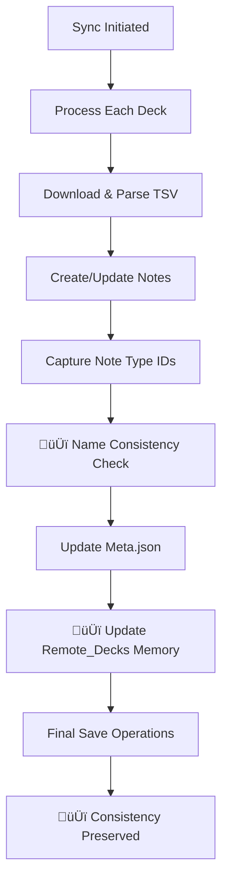

# 🛠️ Sheets2Anki - Developer Documentation

This document provides technical information about the **Sheets2Anki** add-on for developers who want to contribute, understand the architecture, or make modifications.

## 📋 Table of Contents
- [System Architecture](#-system-architecture)
- [Project Structure](#-project-structure)
- [Main Components](#-main-components)
- [Data Flow](#-data-flow)
- [APIs and Integrations](#-apis-and-integrations)
- [Development Setup](#-development-setup)
- [Build and Deploy](#-build-and-deploy)
- [Tests](#-tests)
- [Debugging](#-debugging)
- [Contributing](#-contributing)

## 🏗️ System Architecture

### Overview
Sheets2Anki is a modular add-on for Anki that synchronizes Google Sheets data with local decks. The architecture follows the **MVC** pattern adapted for Anki add-ons:

```
┌─────────────────┐    ┌──────────────────┐    ┌─────────────────┐
│   UI Layer      │    │   Business       │    │   Data Layer    │
│   (Dialogs)     │◄──►│   Logic          │◄──►│   (Managers)    │
│                 │    │   (Sync Engine)  │    │                 │
└─────────────────┘    └──────────────────┘    └─────────────────┘
        ▲                        ▲                        ▲
        │                        │                        │
        ▼                        ▼                        ▼
┌─────────────────┐    ┌──────────────────┐    ┌─────────────────┐
│   Anki API      │    │   Google Sheets  │    │   File System   │
│   Integration   │    │   TSV Parser     │    │   JSON Config   │
└─────────────────┘    └──────────────────┘    └─────────────────┘
```

### Main Design Patterns

#### 1. **Manager Pattern**
- `ConfigManager`: Persistent settings
- `DeckManager`: Anki deck operations
- `StudentManager`: Student management
- `BackupManager`: Backup system

#### 2. **Strategy Pattern**
- `DataProcessor`: Different processing strategies (Basic vs Cloze cards)
- Sync strategies: Incremental vs full sync

#### 3. **Observer Pattern**
- Event-driven updates between components
- Progress callbacks during synchronization

## 🆕 Recent Improvements - Current Version

### 🔧 **Name Consistency System** (`src/name_consistency_manager.py`)

#### **Solved Problem:**
- Inconsistencies between note type names in Anki vs. configuration
- Correction reversals by later save operations
- Lack of automatic synchronization during the sync process

#### **Implemented Solution:**
```python
class NameConsistencyManager:
    @staticmethod
    def ensure_consistency_during_sync(
        deck_url: str, 
        remote_decks: Optional[Dict] = None,
        debug_callback=None
    ) -> Dict[str, Any]:
        """Ensures name consistency during synchronization"""
        
    @staticmethod
    def update_remote_decks_in_memory(
        deck_url: str,
        remote_decks: Dict,
        local_deck_name: str,
        note_types: Dict[str, str],
        debug_callback
    ):
        """Updates in-memory data to avoid reversal"""
```

#### **Technical Features:**
- **Automatic Detection:** Checks for inconsistencies after each deck sync
- **Dual Correction:** Updates both meta.json and in-memory dictionary
- **Reversal Prevention:** Prevents later `save_remote_decks()` from reverting changes
- **Detailed Debug:** Complete log of all consistency operations

### 📊 **Enhanced Summary Interface** (`src/sync.py`)

#### **Reorganization of `generate_detailed_view()`:**
```python
def generate_detailed_view(total_stats, sync_errors=None, deck_results=None):
    """
    Generates detailed view with optimized order:
    1. FIRST: Aggregated general summary
    2. SECOND: Individual details per deck
    """
    details_content = []
    
    # FIRST: Show aggregated general summary
    aggregated_summary = generate_aggregated_summary_only(total_stats, sync_errors)
    if aggregated_summary:
        details_content.append("📋 AGGREGATED GENERAL SUMMARY:")
        details_content.extend(aggregated_summary)
    
    # SECOND: Show summary per individual deck
    if deck_results and len(deck_results) > 1:
        details_content.append("📊 INDIVIDUAL DECK SUMMARY:")
        # ... deck details
```

#### **UX Improvements:**
- **Logical Order:** General Overview → Specific Details
- **Performance:** Optimized rendering for large volumes
- **Consistency:** Uniform data presentation standard

### 🔄 **Updated Sync Flow:**



#### **Critical Improvement Points:**
1. **Line 2002 sync.py:** Consistency system call
2. **Dual Update:** Meta.json + in-memory remote_decks
3. **Final Save:** Correctness persistence guarantee
- Progress callbacks during synchronization

## 📁 Project Structure

```
sheets2anki/
├── 📄 __init__.py              # Add-on entry point
├── 📄 config.json              # Default settings
├── 📄 manifest.json            # Add-on metadata
├── 📄 meta.json                # AnkiWeb info
├── 📁 src/                     # Main source code
│   ├── 📄 __init__.py
│   ├── 📄 sync.py              # 🔥 Synchronization engine (2142 lines)
│   ├── 📄 data_processor.py    # TSV data processing
│   ├── 📄 config_manager.py    # Settings management
│   ├── 📄 deck_manager.py      # Anki deck operations
│   ├── 📄 student_manager.py   # Student management system
│   ├── 📄 backup_system.py     # Backup/restore system
│   ├── 📄 ankiweb_sync.py      # AnkiWeb integration
│   ├── 📄 utils.py             # General utilities
│   ├── 📄 compat.py            # Version compatibility
│   ├── 📄 templates_and_definitions.py  # Card templates
│   └── 📄 *_dialog.py          # User interfaces
├── 📁 libs/                    # Bundled external libraries
│   ├── 📄 beautifulsoup4/
│   ├── 📄 chardet/
│   └── 📄 org_to_anki/
├── 📁 build/                   # Build artifacts
├── 📁 scripts/                 # Build and deploy scripts
├── 📁 tests/                   # Unit tests
└── 📁 docs/                    # Documentation
```

### Critical Files

#### **src/sync.py** (2142 lines)
The heart of the system. Contains:
- `SyncManager` main class
- `syncDecks()`: Synchronization entry point
- `_sync_single_deck()`: Per-deck synchronization logic
- `_process_students()`: Student processing
- Hierarchical tag management
- Note type detection and creation

#### **src/data_processor.py**
Responsible for:
- Parsing Google Sheets TSV
- Data validation (23 supported columns)
- Automatic Cloze card detection
- Input data normalization

#### **src/config_manager.py**
Manages:
- Persistent JSON settings
- Connected spreadsheet URLs
- Sync preferences
- Backup settings

## 🔧 Main Components

### 1. **Synchronization System** (`src/sync.py`)

#### Main Classes:
```python
class SyncManager:
    def __init__(self, mw: AnkiQt)
    def syncDecks() -> None
    def _sync_single_deck(deck_name: str, url: str) -> Dict
    def _process_students(deck_name: str, data: List[Dict]) -> None
    def _create_or_update_note(note_data: Dict) -> Note
```

#### Sync Flow:
1. **Fetch Data**: Spreadsheet TSV download
2. **Parse & Validate**: 23 columns validation
3. **Student Processing**: Active students filtering
4. **Note Creation/Update**: Anki notes CRUD
5. **Tag Management**: Hierarchical tags application
6. **Deck Organization**: Subdecks creation
7. **Cleanup**: Orphaned data removal

### 2. **Student Management System** (`src/student_manager.py`)

#### Features:
- **Global Configuration**: Active students across all decks
- **Individual Filtering**: Per specific deck
- **Automatic Subdeck Creation**: Hierarchical structure
- **Custom Note Types**: One per student

```python
class StudentManager:
    def get_global_students() -> List[str]
    def set_global_students(students: List[str]) -> None
    def filter_data_by_students(data: List[Dict]) -> List[Dict]
    def create_student_subdecks(deck_name: str, students: List[str]) -> None
```

### 3. **Data Processor** (`src/data_processor.py`)

#### Responsibilities:
- **TSV Parsing**: String → data structure conversion
- **Column Validation**: 23 columns verification
- **Cloze Detection**: Regex for `{{c1::text}}`
- **Data Normalization**: Cleanup and standardization

```python
class DataProcessor:
    def parse_tsv(tsv_content: str) -> List[Dict]
    def validate_columns(data: List[Dict]) -> bool
    def detect_cloze_cards(question: str) -> bool
    def normalize_student_names(names: str) -> List[str]
```

### 4. **Backup System** (`src/backup_system.py`)

#### Backup Types:
- **Manual Backup**: User initiated
- **Safety Backup**: Before restore operations
- **Configuration Backup**: Settings + decks + students

```python
class BackupManager:
    def create_backup(include_decks=True, include_students=True) -> str
    def restore_backup(backup_file: str) -> None
    def list_available_backups() -> List[BackupInfo]
```

### 5. **AnkiWeb Integration** (`src/ankiweb_sync.py`)

#### Integration:
```python
class AnkiWebSyncManager:
    def auto_sync_after_changes() -> None
    def test_connectivity() -> SyncStatus
    def sync_with_ankiweb() -> None   # Anki 25.x+ modern API
```

## 🔄 Data Flow

### 1. **User Action → Sync Trigger**
```
User clicks "Sync" (Ctrl+Shift+S)
    ↓
sync_dialog.py → SyncManager.syncDecks()
    ↓
For each configured deck:
    ↓
_sync_single_deck(deck_name, url)
```

### 2. **Data Fetching & Processing**
```
Google Sheets URL → TSV Download
    ↓
DataProcessor.parse_tsv() → List[Dict]
    ↓
Column validation (18 cols required)
    ↓
StudentManager.filter_data_by_students()
    ↓
Filtered data ready for sync
```

### 3. **Note Creation & Organization**
```
For each row in filtered_data:
    ↓
Detect card type (Basic vs Cloze)
    ↓
Create/Update Anki Note
    ↓
Apply hierarchical tags
    ↓
Place in correct subdeck
    ↓
Update progress stats
```

### 4. **Post-Sync Actions**
```
Sync completion
    ↓
Cleanup orphaned data
    ↓
AnkiWeb auto-sync (if enabled)
    ↓
Update UI with results
    ↓
Log completion stats
```

## 🔌 APIs and Integrations

### **Anki API Usage**

#### Core APIs:
```python
# Collection operations
mw.col.decks.add_config_dict()
mw.col.decks.new_filtered()

# Note operations  
mw.col.newNote(note_type)
mw.col.addNote(note)
mw.col.updateNote(note)

# Model (Note Type) operations
mw.col.models.new()
mw.col.models.addTemplate()
mw.col.models.save()
```

#### Compatibility:
- **Anki 25.x+**: Qt6 with modern async API
- **Database**: Direct SQLite for complex queries

### **Google Sheets Integration**

#### TSV Format Requirements:
- **Flexible URLs**: Supports both published TSV and edit URLs
- **23 Columns**: Mandatory structure
- **UTF-8 Encoding**: Character encoding
- **Tab Separated**: Not comma-separated

#### Supported URL Patterns:
```
# Published TSV URL (traditional format)
https://docs.google.com/spreadsheets/d/e/{PUBLICATION_KEY}/pub?output=tsv

# Edit URL (automatically converted to TSV)
https://docs.google.com/spreadsheets/d/{SPREADSHEET_ID}/edit?usp=sharing

# Export URL (already in TSV format)
https://docs.google.com/spreadsheets/d/{SPREADSHEET_ID}/export?format=tsv&gid=0
```

#### URL Processing:
- **Automatic Conversion**: Edit URLs are automatically converted to TSV export format
- **Backward Compatibility**: Traditional published URLs continue to work
- **Hash Generation**: Uses publication key or spreadsheet ID for consistent identification

### **File System Operations**

#### Configuration Storage:
- **Location**: Anki user data folder
- **Format**: JSON files
- **Backup**: Automatic on changes

#### Paths:
```python
CONFIG_FILE = os.path.join(ADDON_DIR, "user_config.json")
BACKUP_DIR = os.path.join(ADDON_DIR, "backups")
LOG_FILE = os.path.join(ADDON_DIR, "debug_sheets2anki.log")
```

## 🚀 Development Setup

### **Prerequisites**
```bash
# Python 3.13+ (required - same version as Anki 25.x)
python --version

# Anki 25.x or newer installed for development
# Download: https://apps.ankiweb.net/
```

### **System Requirements**
- **Python:** 3.13 or newer
- **Anki:** Version 25.x or newer
- **Qt:** Qt6 (included with Anki 25.x)
- **Operating System:** Windows, macOS, or Linux

### **Clone and Setup**
```bash
# Clone the repository
git clone https://github.com/igorrflorentino/sheets2anki.git
cd sheets2anki

# Install development dependencies
pip install -r requirements-dev.txt

# Install in development mode in Anki
# Copy folder to: ~/Documents/Anki2/addons21/sheets2anki_dev/
```

### **Development Structure**
```bash
# Symbolic link for active development
ln -s /path/to/dev/sheets2anki ~/.local/share/Anki2/addons21/sheets2anki_dev

# Or copy files
cp -r src/* ~/.local/share/Anki2/addons21/sheets2anki_dev/
```

### **IDE Configuration**
```json
// .vscode/settings.json
{
    "python.defaultInterpreterPath": "/path/to/anki/python",
    "python.analysis.extraPaths": [
        "/path/to/anki/lib",
        "/path/to/anki/aqt"
    ]
}
```

## 🏗️ Build and Deploy

### **Build Scripts**

#### **1. Build Standalone Package**
```bash
# Creates package with all dependencies
python scripts/create_standalone_package.py
```

#### **2. Build AnkiWeb Package**
```bash
# Creates AnkiWeb compatible package
python scripts/create_ankiweb_package.py
```

#### **3. Validate Packages**
```bash
# Validates the structure of created packages
python scripts/validate_packages.py
```

### **Build Process**

#### Standalone Package:
1. **Copy Source**: `src/` → `build/sheets2anki-standalone/`
2. **Bundle Dependencies**: `libs/` included
3. **Create Manifest**: Complete metadata
4. **ZIP Package**: `sheets2anki-standalone.ankiaddon`

#### AnkiWeb Package:
1. **Copy Source**: `src/` → `build/sheets2anki/`
2. **Exclude Dependencies**: AnkiWeb installs automatically
3. **Minimal Manifest**: Essential metadata
4. **ZIP Package**: `sheets2anki.ankiaddon`

### **Deploy Pipeline**

#### Manual Deploy:
```bash
# 1. Validate code
python -m pytest tests/

# 2. Build packages
python scripts/build_packages.py

# 3. Test installation
# Install in test Anki

# 4. Upload to AnkiWeb
# Via official web interface
```

#### Release Process:
1. **Version Bump**: `meta.json` and `manifest.json`
2. **Changelog**: Document changes
3. **Build & Test**: Functional packages
4. **Tag Release**: `git tag v1.x.x`
5. **Upload**: AnkiWeb submission

## 🧪 Tests

### **Test Structure**
```
tests/
├── test_sync.py              # Synchronization engine tests
├── test_data_processor.py    # TSV processor tests
├── test_student_manager.py   # Student management tests
├── test_backup_system.py     # Backup/restore tests
├── test_config_manager.py    # Configuration tests
└── fixtures/                 # Test data
    ├── sample_tsv/
    └── mock_configs/
```

### **Running Tests**
```bash
# All tests
python -m pytest tests/ -v

# Specific tests
python -m pytest tests/test_sync.py -v

# With coverage
python -m pytest tests/ --cov=src/ --cov-report=html
```

### **Mock Data**
```python
# tests/fixtures/sample_data.py
SAMPLE_TSV_DATA = [
    {
        'ID': 'Q001',
        'PERGUNTA': 'Capital of Brazil?',
        'LEVAR PARA PROVA': 'Brasília',
        'SYNC': 'true',
        'ALUNOS': 'João, Maria',
        # ... 18 more columns
    }
]
```

### **Test Categories**

#### **1. Unit Tests**
- Isolated functions
- Mocking of external dependencies
- Business logic validation

#### **2. Integration Tests**
- Complete sync flow
- Anki API integration
- Real data processing

#### **3. UI Tests**
- Dialogs and interactions
- Input validation
- Error handling

## 🐛 Debugging

### **Logging System**
```python
# Logs configuration
import logging
logger = logging.getLogger("sheets2anki")
logger.setLevel(logging.DEBUG)

# File output
handler = logging.FileHandler("debug_sheets2anki.log")
logger.addHandler(handler)
```

### **Debug Tools**

#### **1. Anki Developer Mode**
```python
# In __init__.py
import sys
# Enable debug mode
sys.path.insert(0, "/path/to/dev/tools")
```

#### **2. Remote Debugging**
```python
# For PyCharm/VSCode remote debugging
import pdb; pdb.set_trace()

# Or remote debugger
import debugpy
debugpy.listen(5678)
debugpy.wait_for_client()
```

#### **3. Console Output**
```python
# Debug prints visible in Anki
from aqt.utils import showInfo
showInfo(f"Debug: {variable_content}")

# Specific debug for name consistency
from .utils import add_debug_message
add_debug_message("Consistency check started", "NAME_CONSISTENCY")
```

### 🆕 **Debugging New Features**

#### **Name Consistency System**

**Important Logs:**
```bash
# File: debug_sheets2anki.log

# Verification start
[13:11:11.617] [NAME_CONSISTENCY] 🔧 Starting consistency check

# Inconsistency detection
[13:11:11.618] [NAME_CONSISTENCY] Note type 1756222007332: 'old_name' vs 'new_name'

# Applied correction
[13:11:11.618] [NAME_CONSISTENCY] 📋 Correct note type in Anki, updating meta.json

# In-memory update
[13:11:11.619] [NAME_CONSISTENCY] 💾 In-memory remote_decks dictionary updated

# Final save
[13:11:11.621] [SYNC] 💾 FINAL_SAVE: Settings saved after verification
```

**Debugging Checklist:**
```python
def debug_consistency_system():
    """To debug consistency issues"""
    
    # 1. Check if function is called
    assert "ensure_consistency_during_sync" in locals()
    
    # 2. Check if remote_decks is passed
    assert remote_decks_param is not None
    
    # 3. Check save operations order
    # Meta.json must be saved AFTER consistency
    
    # 4. Check if changes persist
    # Compare before/after in meta.json
```

**Common Issues:**
- **Changes reversal:** later `save_remote_decks()` overwrites
- **Data doesn't persist:** FINAL_SAVE not executed
- **Missing logs:** debug_callback not configured

#### **Summary Interface**

**Check Section Order:**
```python
def test_summary_order():
    result = generate_detailed_view(stats, errors, deck_results)
    
    # Find section indices
    agregado_idx = next(i for i, line in enumerate(result) 
                       if "AGGREGATED GENERAL SUMMARY" in line)
    individual_idx = next(i for i, line in enumerate(result) 
                         if "INDIVIDUAL DECK SUMMARY" in line)
    
    # Verify correct order
    assert agregado_idx < individual_idx, "Incorrect order!"
```

### **Common Issues**

#### **1. Encoding Problems**
```python
# TSV parsing
content = response.content.decode('utf-8-sig')  # Remove BOM

# File operations
with open(file_path, 'r', encoding='utf-8') as f:
    data = f.read()
```

#### **2. Qt6 API Usage**
```python
# All code uses Qt6 enums
from aqt.qt import Qt
alignment = Qt.AlignmentFlag.AlignCenter  # Qt6 style
```

#### **3. Threading Issues**
```python
# UI updates must be on main thread
from aqt.qt import QTimer

def safe_ui_update():
    QTimer.singleShot(0, lambda: update_progress_bar())
```

## 📝 Code Style and Conventions

### **Python Style Guide**
- **PEP 8**: Standard Python style
- **Type Hints**: When possible
- **Docstrings**: Google style
- **Line Length**: 88 characters (Black formatter)

### **Naming Conventions**
```python
# Classes: PascalCase
class SyncManager:

# Functions/methods: snake_case  
def sync_decks():

# Constants: UPPER_SNAKE_CASE
MAX_RETRY_ATTEMPTS = 3

# Private methods: _leading_underscore
def _internal_helper():
```

### **Documentation Standards**
```python
def sync_single_deck(deck_name: str, url: str) -> Dict[str, Any]:
    """Synchronizes a specific deck with remote spreadsheet.
    
    Args:
        deck_name: Deck name in Anki
        url: Google Sheets (TSV) URL
        
    Returns:
        Dict containing sync statistics:
        - cards_created: int
        - cards_updated: int  
        - cards_deleted: int
        - students_processed: List[str]
        
    Raises:
        SyncError: If URL is invalid or data is corrupted
        ConnectionError: If cannot connect to spreadsheet
    """
```

## 🤝 Contributing

### **Contribution Process**

#### **1. Fork & Clone**
```bash
# Fork on GitHub
# Clone your fork
git clone https://github.com/your-username/sheets2anki.git
cd sheets2anki
```

#### **2. Create Branch**
```bash
# Descriptive branch
git checkout -b feature/add-excel-support
git checkout -b fix/fix-tsv-encoding
git checkout -b docs/update-readme-dev
```

#### **3. Development**
```bash
# Install in dev mode
# Make changes
# Test locally
python -m pytest tests/
```

#### **4. Commit & Push**
```bash
# Descriptive commits
git add .
git commit -m "feat: add support for Excel files

- Implement parser for .xlsx
- Add Excel column validation  
- Maintain TSV compatibility
- Add tests for Excel parser"

git push origin feature/add-excel-support
```

#### **5. Pull Request**
- **Clear title**: Describe the change
- **Detailed description**: What, why, how
- **Tests**: Evidence that it works
- **Screenshots**: For UI changes

### **Contribution Guidelines**

#### **Code Quality**
- ✅ Tests passing: `pytest tests/`
- ✅ Style check: `flake8 src/`
- ✅ Type check: `mypy src/`
- ✅ Documentation updated

#### **Types of Contributions**
- 🐛 **Bug Fixes**: Problem corrections
- ✨ **Features**: New functionalities
- 📚 **Documentation**: Docs improvements
- 🎨 **UI/UX**: Interface improvements
- ⚡ **Performance**: Optimizations
- 🧪 **Tests**: Test coverage

#### **Priority Areas**
1. **Error Handling**: Better error treatment
2. **Performance**: Optimization for large datasets
3. **UI/UX**: More intuitive interface
4. **Testing**: Greater test coverage
5. **Documentation**: More examples and tutorials

### **Development Resources**

#### **Anki Development**
- [Anki Add-on Development Guide](https://addon-docs.ankiweb.net/)
- [Anki Source Code](https://github.com/ankitects/anki)
- [AnkiWeb Add-on Sharing](https://ankiweb.net/shared/addons/)

#### **Python Resources**
- [Python Type Hints](https://docs.python.org/3/library/typing.html)
- [pytest Documentation](https://docs.pytest.org/)
- [Black Code Formatter](https://black.readthedocs.io/)

#### **Tools & Libraries**
- **BeautifulSoup4**: HTML/XML parsing
- **Requests**: HTTP client (if needed)
- **PyQt5/6**: GUI framework (used by Anki)

## 📊 Performance Considerations

### **Optimization Areas**

#### **1. Large Dataset Handling**
```python
# Batch processing for large spreadsheets
def process_in_batches(data: List[Dict], batch_size: int = 100):
    for i in range(0, len(data), batch_size):
        batch = data[i:i + batch_size]
        yield batch

# Memory-efficient TSV parsing
def parse_tsv_stream(file_path: str):
    with open(file_path, 'r') as f:
        reader = csv.DictReader(f, delimiter='\t')
        for row in reader:
            yield row
```

#### **2. Database Optimization**
```python
# Bulk operations when possible
notes_to_add = []
for data_row in processed_data:
    note = create_note(data_row)
    notes_to_add.append(note)

# Single transaction
with mw.col.backend.db.begin():
    for note in notes_to_add:
        mw.col.addNote(note)
```

#### **3. Caching Strategy**
```python
# Note types cache to avoid recreation
_note_type_cache = {}

def get_or_create_note_type(deck_name: str, student: str) -> NotetypeDict:
    cache_key = f"{deck_name}::{student}"
    if cache_key not in _note_type_cache:
        _note_type_cache[cache_key] = create_note_type(deck_name, student)
    return _note_type_cache[cache_key]
```

### **Memory Management**
- **Lazy Loading**: Load data on demand
- **Cleanup**: Clear unused objects
- **Progress Callbacks**: Avoid blocking UI

### **Network Optimization**
- **Connection Pooling**: For multiple requests
- **Retry Logic**: With exponential backoff
- **Timeout Handling**: Avoid hangs

---

## 📚 Additional Resources

### **Architecture Diagrams**
*(Consider adding visual architecture diagrams)*

### **API Reference**
*(Link to detailed API documentation)*

### **Examples & Tutorials**
*(Practical development examples)*

### **Troubleshooting**
*(Common issues solution guide)*

---

**📞 Developer Contact**
For technical questions, open an issue on GitHub or contact us through official channels.

**🔄 Last updated:** August 2025
